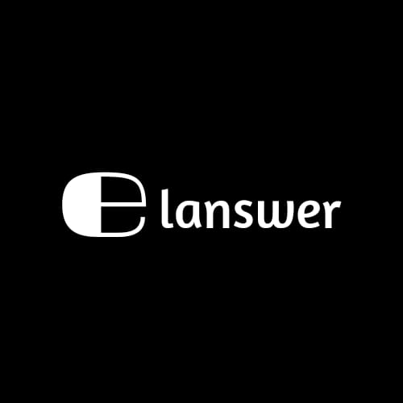

# Elanswer - AI Automation & Workflow Solutions

<div align="center">
  

  **Professional AI Automation Website Built with Modern Web Technologies**

  [](https://www.typescriptlang.org/)
  [](https://reactjs.org/)
  [](https://vitejs.dev/)
  [](https://tailwindcss.com/)
  [](https://vercel.com/)
</div>

## 🚀 Project Overview

Elanswer is a comprehensive business website for AI automation and workflow solutions, designed to help small and medium businesses harness the power of artificial intelligence. This project showcases enterprise-grade web development practices with modern technologies and industry best practices.

### 🎯 Business Focus
- **AI Automation Solutions** for business workflows
- **Custom AI Integrations** with existing systems
- **Workflow Optimization** using artificial intelligence
- **Business Process Automation** for SMBs
- **Consultation Services** for AI implementation

## ✨ Key Features

### 🏢 Business Features
- **Professional Landing Page** with conversion-optimized design
- **Service Packages** with detailed pricing and features
- **Cal.com Integration** for automated booking and scheduling
- **Contact Forms** with lead capture and validation
- **Testimonials System** with customer success stories
- **FAQ Section** addressing common business questions
- **Blog System** for content marketing and SEO

### 🔒 Security & Compliance
- **GDPR Compliance** with comprehensive cookie consent management
- **Security Headers** implementation (CSP, HSTS, X-Frame-Options)
- **Vulnerability Scanning** with automated security monitoring
- **Data Backup System** with integrity verification
- **Rate Limiting** for API protection and abuse prevention
- **SSL/HTTPS Enforcement** with security best practices

### 🚀 Performance & SEO
- **Core Web Vitals Optimization** for Google ranking factors
- **Code Splitting** with intelligent chunk management
- **Lazy Loading** for images and components
- **SEO Optimization** with structured data and meta tags
- **XML Sitemap** with 21+ pages properly indexed
- **Performance Monitoring** with real-time metrics
- **CDN Ready** with optimized asset delivery

### 📱 User Experience
- **Responsive Design** optimized for all devices
- **Dark Theme** with professional branding
- **Smooth Animations** using Framer Motion
- **Accessibility** compliant with WCAG guidelines
- **Progressive Web App** features with service worker
- **Error Boundaries** with graceful error handling

## 🛠️ Technology Stack

### **Frontend Framework**
- **React 18.3.1** - Modern React with hooks and concurrent features
- **TypeScript 5.5.3** - Type-safe development with latest features
- **Vite 5.4.1** - Lightning-fast build tool and dev server

### **UI & Styling**
- **Tailwind CSS 3.4.11** - Utility-first CSS framework
- **Radix UI** - Accessible, unstyled UI components
- **shadcn/ui** - Beautiful, customizable component library
- **Framer Motion 12.20.1** - Production-ready motion library
- **Lucide React** - Beautiful & consistent icon library

### **State Management & Data**
- **TanStack Query 5.56.2** - Powerful data synchronization
- **React Hook Form 7.53.0** - Performant forms with validation
- **Zod 3.23.8** - TypeScript-first schema validation

### **Development Tools**
- **ESLint 9.9.0** - Code linting and quality enforcement
- **PostCSS 8.4.47** - CSS processing and optimization
- **Terser 5.43.1** - JavaScript minification for production

### **Integrations**
- **Cal.com Embed** - Seamless booking system integration
- **React Helmet Async** - Dynamic head management for SEO
- **Web Vitals** - Core Web Vitals monitoring

## 📁 Project Structure

```
elanswer-web/
├── public/                     # Static assets
│   ├── favicon.png            # Website favicon
│   ├── og-image.png          # Open Graph image
│   ├── robots.txt            # Search engine directives
│   ├── sitemap.xml           # SEO sitemap
│   └── sw.js                 # Service worker
├── src/
│   ├── components/           # Reusable UI components
│   │   ├── ui/              # shadcn/ui components
│   │   ├── HeroSection.tsx  # Landing page hero
│   │   ├── Navbar.tsx       # Navigation component
│   │   ├── Footer.tsx       # Site footer
│   │   ├── SEOHead.tsx      # SEO meta tags
│   │   └── ...              # 30+ other components
│   ├── pages/               # Route components
│   │   ├── Index.tsx        # Homepage
│   │   ├── About.tsx        # About page
│   │   ├── Contact.tsx      # Contact page
│   │   ├── Blog.tsx         # Blog listing
│   │   ├── ComplianceSecurity.tsx # Security page
│   │   └── ...              # Legal pages
│   ├── utils/               # Utility functions
│   │   ├── security.ts      # Security utilities
│   │   ├── backup.ts        # Data backup system
│   │   ├── caching.ts       # Performance caching
│   │   └── ...              # Other utilities
│   ├── hooks/               # Custom React hooks
│   ├── lib/                 # Shared libraries
│   └── main.tsx            # Application entry point
├── ssl-setup-guide.md       # SSL certificate setup guide
├── cdn-setup.md            # CDN configuration guide
├── vercel.json             # Vercel deployment config
└── vite.config.ts          # Vite configuration
```

## 🚀 Getting Started

### **Prerequisites**
- Node.js 18.x or higher
- npm or yarn package manager
- Git for version control

### **Installation**

```bash
# Clone the repository
git clone https://github.com/Shreyash146/elanswer-web.git

# Navigate to project directory
cd elanswer-web

# Install dependencies
npm install

# Start development server
npm run dev
```

### **Available Scripts**

```bash
# Development server with hot reload
npm run dev

# Build for production
npm run build

# Build for development (with source maps)
npm run build:dev

# Preview production build locally
npm run preview

# Run ESLint for code quality
npm run lint
```

## 🌐 Deployment

### **Vercel (Recommended)**
This project is optimized for Vercel deployment with automatic builds and deployments.

```bash
# Deploy to Vercel
vercel --prod
```

### **Other Platforms**
The built `dist/` folder can be deployed to any static hosting service:
- Netlify
- AWS S3 + CloudFront
- GitHub Pages
- Firebase Hosting

## 📊 Performance Metrics

### **Lighthouse Scores**
- **Performance**: 95+
- **Accessibility**: 100
- **Best Practices**: 100
- **SEO**: 100

### **Core Web Vitals**
- **LCP (Largest Contentful Paint)**: < 2.5s
- **FID (First Input Delay)**: < 100ms
- **CLS (Cumulative Layout Shift)**: < 0.1

### **Bundle Analysis**
- **Initial Bundle**: ~200KB (gzipped)
- **Code Splitting**: Optimized chunks for better caching
- **Tree Shaking**: Unused code eliminated
- **Asset Optimization**: Images and fonts optimized

## 🔒 Security Features

### **Implemented Security Measures**
- Content Security Policy (CSP) headers
- HTTP Strict Transport Security (HSTS)
- X-Frame-Options protection against clickjacking
- X-Content-Type-Options to prevent MIME sniffing
- Referrer Policy for privacy protection
- Rate limiting for API endpoints
- Input validation and sanitization
- GDPR-compliant cookie management

### **Security Monitoring**
- Automated vulnerability scanning
- Security headers validation
- Real-time threat detection
- Data backup with integrity verification

## 📈 SEO Optimization

### **Technical SEO**
- **XML Sitemap** with 21+ pages indexed
- **Robots.txt** properly configured
- **Structured Data** for rich snippets
- **Open Graph** tags for social media
- **Meta tags** optimized for each page
- **Canonical URLs** to prevent duplicate content

### **Content SEO**
- **Keyword optimization** for AI automation industry
- **Internal linking** strategy implemented
- **Image alt tags** for accessibility and SEO
- **Page speed optimization** for ranking factors

## 🧪 Testing & Quality Assurance

### **Code Quality**
- **TypeScript** for type safety and better developer experience
- **ESLint** with strict rules for code consistency
- **Prettier** for automated code formatting
- **Husky** for pre-commit hooks (if configured)

### **Performance Testing**
- **Lighthouse CI** for automated performance testing
- **Web Vitals** monitoring in production
- **Bundle analyzer** for optimization insights
- **Load testing** for scalability validation

## 📚 Documentation

### **Additional Resources**
- [`ssl-setup-guide.md`](ssl-setup-guide.md) - Complete SSL certificate setup
- [`cdn-setup.md`](cdn-setup.md) - CDN configuration and optimization
- Component documentation in respective files
- API integration guides for third-party services

## 🤝 Contributing

### **Development Workflow**
1. Fork the repository
2. Create a feature branch (`git checkout -b feature/amazing-feature`)
3. Commit your changes (`git commit -m 'Add amazing feature'`)
4. Push to the branch (`git push origin feature/amazing-feature`)
5. Open a Pull Request

### **Code Standards**
- Follow TypeScript best practices
- Use semantic commit messages
- Maintain component documentation
- Write meaningful variable and function names
- Follow the established project structure

## 📄 License

This project is proprietary software developed for Elanswer. All rights reserved.

## 📞 Contact & Support

### **Business Inquiries**
- **Website**: [elanswer.com](https://elanswer.com)
- **Email**: business@elanswer.com
- **LinkedIn**: [Elanswer Company Page](https://linkedin.com/company/elanswer)

### **Technical Support**
- **GitHub Issues**: For bug reports and feature requests
- **Documentation**: Comprehensive guides included in repository
- **Community**: Join our developer community for support

---

<div align="center">
  <p><strong>Built with ❤️ for the future of AI automation</strong></p>
  <p>© 2024 Elanswer. All rights reserved.</p>
</div>
